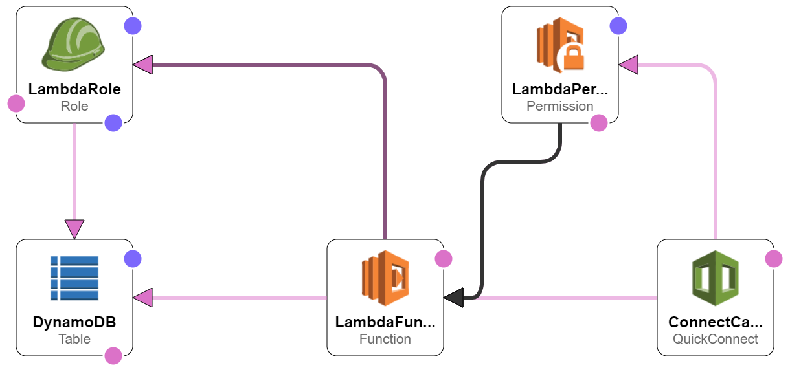

#### Other Pages:
- [Overview](README.md)
- [Running the Python Application Locally](RUNPYTHONAPP.md)
- [Contact Flow Instructions](CONTACTFLOW.md)
- [Managing The Project (Trello Board)](https://trello.com/b/MtaGkEdG/voicefoundry-code-challenge)
- [Blockers (Trello Board)](https://trello.com/b/MtaGkEdG/voicefoundry-code-challenge)

### On this page:
- [Problems I ran into](#problems-i-ran-into)
- [Instructions for Uploading the CloudFormation](#instructions-for-uploading)

#### Problems I ran into:

I was able to create a CloudFormation for all services successfuly, except for the Connect service. It kept failing on deployment and I found documentation on Connect CloudFormation properties and attributes to be quite sparse. 

For this reason, I've included two CloudFormation templates. One fully working one, and one buggy one. You can find them in the root folder: 

```
[ConnnectLambdaDynamoDBCloudFormation](ConnnectLambdaDynamoDBCloudFormation)
```
and
```
LambdaDynamoDBCloudFormation
```
The second one will deploy everything you need to pipe information into the Connect Vanity Number Call Center: Lambada, DynamoDB, Roles, Permissions. You'll just have to set up the Call center itself independently. 

## Instructions for Uploading


From the [CloudFormation service page](https://us-west-2.console.aws.amazon.com/cloudformation/home?region=us-west-2#/):
1. click Create Stack 
2. select ``` Template is Ready ``` and ``` Upload Template File ``` radios and click ``` upload ```. Upload one of the above templates (found in the root folder)
3. click ``` Next ```
4. Name the stack
5. Configure Options (don't really need to do anything)
6. Review, Acknowledge click Submit

#### Notes on the Lambda Function:

The CloudFormation is set up to upload the Lambda function code from a zip file in a public S3 bucket. The function is named ```ConnectGetVanityNumbers```. You'll see in the AWS code editor that the ```vanity-numbers-master``` folder (this entire repo) was placed in the root folder. You'll need to move the ```vanitynumbers``` folder and ```lambda_function``` into the root folder (ConnectGetVanityNumbers). Once they are in the root folder you can delete the ```vanity-numbers-master folder```.


