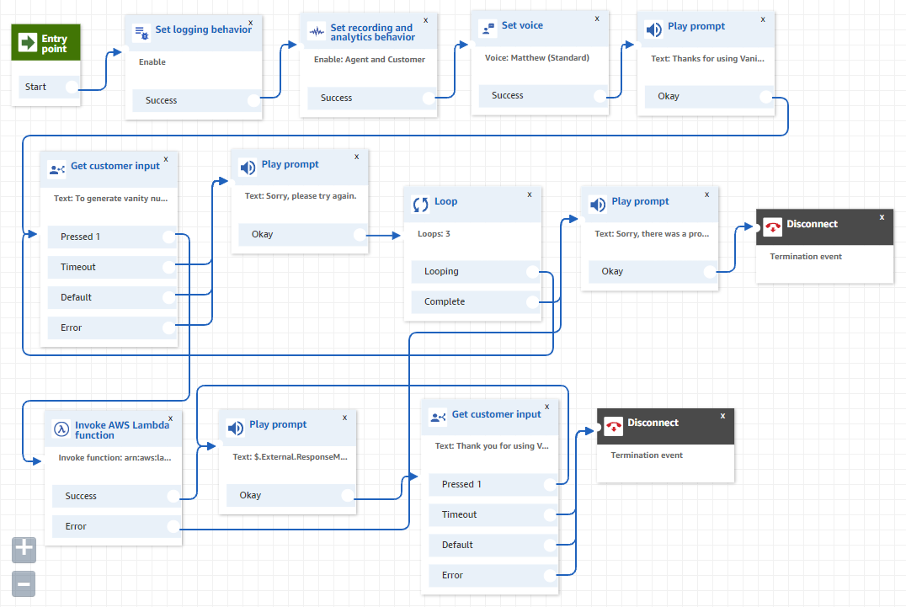

# VoiceFoundry Code Challenge

## Contents:
- [Overview](#overview)
- [Running the Python Application Locally](RUNPYTHONAPP.md)
- [CloudFormation Instructions](CLOUDFORMATION.md)
- [Contact Flow Instructions](CONTACTFLOW.md)
- [Managing The Project (Trello Board)](https://trello.com/b/MtaGkEdG/voicefoundry-code-challenge)
- [Blockers](https://trello.com/b/MtaGkEdG/voicefoundry-code-challenge)

## Overview:

#### Tech Stack
- AWS Lambda
- AWS DynamoDB
- AWS Connect
- Python (for the lambda function)

#### Cloud Architecture

#### Contact Flow

